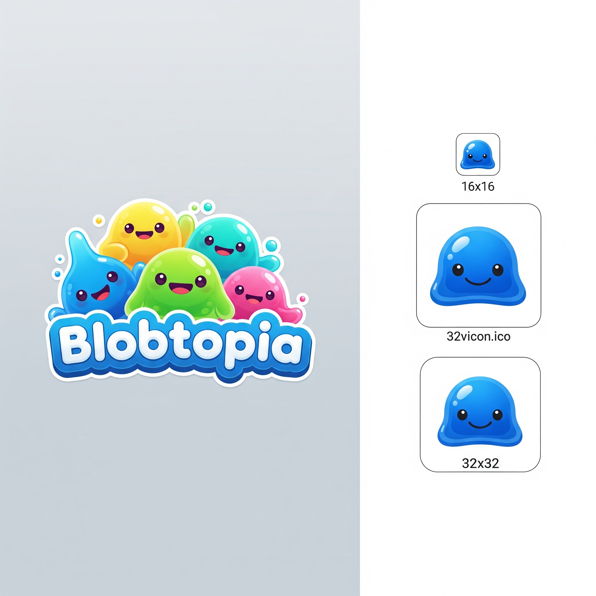

<p align="center">
  
</p>

<h1 align="center">Blobtopia</h1>

<p align="center">
  <strong>Eine interaktive 3D-Gesellschaftssimulation als Lehrwerkzeug für empirische Sozialforschung.</strong>
</p>

<p align="center">
  <a href="https://blobtopia.vercel.app/#/s/0?intro=1"><strong>Blobtopia live ausprobieren</strong></a>
</p>

Blobtopia ist eine simulierte Stadt mit 500 kugelförmigen Wesen -- den *Blobs* -- die in fünf Distrikten leben, arbeiten, wählen und protestieren. Studierende erforschen diese Gesellschaft wie echte Sozialforscher\*innen: durch Beobachtung, Interviews, Datenanalyse und Inhaltsanalyse.

Teil des **Globtopia-Lehrkonzepts** für das Proseminar *Methoden I* (B.A. Politikwissenschaft) an der Philipps-Universität Marburg.

---

## Inspiration & Credits

Blobtopia baut auf drei Projekten auf, ohne die es nicht existieren würde:

- **[minutelabsio/evolution-simulator](https://github.com/minutelabsio/evolution-simulator)** von Jasper Palfree (GPL-3.0) -- Die ursprüngliche Simulationsplattform (Vue.js + Three.js), deren Architektur und Rendering-Pipeline als Grundlage für Blobtopia dient. Die Blob-Kreaturen, das Komponentensystem und der 3D-Viewer stammen aus diesem Projekt.

- **[Primer Learning](https://www.youtube.com/@PrimerLearning)** -- Der YouTube-Kanal von Justin Helps, dessen Simulationsvideos zu Evolution, natürlicher Selektion und emergenten Gesellschaften die Idee inspirierten, kugelförmige Agenten (*Blobs*) als intuitive Repräsentationen sozialer Akteure einzusetzen.

- **[Kenney](https://kenney.nl)** -- Die 3D-Stadtmodelle (Gebäude, Straßen, Vegetation, Infrastruktur) stammen aus den Asset-Packs von Kenney Vleugels, insbesondere den Packs *City Kit (Suburban)*, *City Kit (Commercial)* und *Nature Kit*. Alle Kenney-Assets sind unter **CC0 1.0 Universal (Public Domain)** lizenziert.

Blobtopia transformiert die biologische Evolutionssimulation in eine **politikwissenschaftliche Gesellschaftssimulation**: Statt Nahrungssuche und Reproduktion modelliert es Einstellungen, Wahlen, soziale Netzwerke und politische Krisen.

---

## Was ist Blobtopia?

Blobtopia ist ein *lebendiges Labor* für die Methodenlehre. Es verbindet drei didaktische Säulen:

1. **Beobachtung** -- Studierende beobachten die 3D-Stadt, erkennen Muster (wer geht wohin, wann, warum?) und unterscheiden sichtbare Merkmale von latenten Konstrukten.

2. **Befragung** -- Ueber ein LLM-basiertes Interview-System (Anthropic Claude) koennen Blobs direkt befragt werden. Jeder Blob antwortet gemaess seinem Persoenlichkeitsprofil, seinen Einstellungen und seiner aktuellen Stimmung -- inklusive sozialer Erwuenschtheit und Antwortverweigerung.

3. **Datenanalyse** -- Artefakte wie der BlobFeed (Twitter-ähnliche Kurznachrichten) und die BlobGazetta (Zeitungsausgaben) liefern Materialien für Inhaltsanalyse, während die vorberechneten Zeitreihendaten quantitative Analysen ermöglichen.

Der Clou: Die Simulation kennt die *wahren Werte* jedes Blobs. Studierende erleben den Unterschied zwischen dem, was sie durch Befragung erfahren, und dem, was tatsaechlich der Fall ist -- und verstehen so Validität, Reliabilität und Messfehler am eigenen Leib.

---

## Architektur

Blobtopia ist **vollständig vorberechnet**. Die gesamte 22-jährige Gesellschaftsentwicklung (8.030 Tage) wird offline durch eine Rust-Simulation generiert und in kompakten JSON-Dateien gespeichert. Das Frontend ist ein reiner Timeline-Player.

```
Rust-Simulation (offline)       Vue.js Frontend (Browser)       Anthropic API (live)
========================       ========================        ====================
Gesellschaftsmodell             3D-Stadt (Three.js)             Blob-Interviews
Einstellungsdynamik      --->   Timeline-Playback         <-->  Chat mit Blobs
Wahlen & Events                 BlobFeed & Gazetta              (einzige Live-Komponente)
Tagesabläufe                   Waypoint-Patrol-Animation
```

Einzige Live-Komponente: Das LLM-Chat-System für Blob-Interviews (Anthropic Claude Haiku).

---

## Stadt-Editor

Unter `/#/editor` liegt das Authoring-Werkzeug für die Stadt (Dozenten-Werkzeug,
Desktop). Werkzeuge: Platzieren im **Stempel-Modus** (Werkzeug bleibt aktiv,
`R` dreht, `Esc` beendet), Auswählen/Verschieben/Drehen, **Straßenzug ziehen**
(L-förmige Linie, Tile-Typen verbinden sich automatisch), Distrikt malen,
Löschen, Undo/Redo (`Ctrl+Z` / `Ctrl+Shift+Z`). Der **Inspektor** (rechts)
editiert pro Gebäude Bezeichnung, Funktion (`functional_type` aus dem
Simulationsmodell) und Kapazität; die **Prüfung** warnt live, wenn die Stadt
nicht simulationstauglich ist (zu wenig Wohnraum für alle Blobs, zerrissenes
Straßennetz, unerreichbare Gebäude).

Der Arbeitsstand wird automatisch als Entwurf gesichert (localStorage).
**„In Welt ansehen"** zeigt den Entwurf sofort in der 3D-Welt (rein visuell —
das Blob-Verhalten bleibt die vorberechnete Standard-Stadt, ein Toast weist
darauf hin). Damit eine neue Stadt wirklich simuliert wird:

```bash
# 1. Im Editor (npm run dev): „In Repo speichern" — schreibt
#    data/blobtopia-city.json + public/blobtopia-city.json synchron
# 2. Simulation neu rechnen + exportieren:
cargo run -p blobtopia-precompute    # ~1 min für 500 Blobs
npm run export
# 3. committen + deployen
```

---

## Die Gesellschaft

### 500 Blobs in 5 Distrikten

| Distrikt | Blobs | Profil |
|---|---|---|
| **Gruental** | 80 | Ländlich, niedrige Zufriedenheit, links-orientiert, geringes Vertrauen |
| **Sonnenberg** | 80 | Wohlhabend, hohe Zufriedenheit, rechts-orientiert, hohes Vertrauen |
| **Hafenviertel** | 120 | Urban-divers, breit gestreute Einstellungen, hohe Durchmischung |
| **Mittelfeld** | 120 | Zentristisch, moderate Werte, Median-Einkommen |
| **Industriezone** | 100 | Arbeiterviertel, niedrige Zufriedenheit, links, niedriges Vertrauen |

Jeder Blob hat: Name, Alter (15--65), Bildungsniveau (0--3), Einkommen, Wohnort, Arbeitsplatz, Parteizugehörigkeit, 9 Einstellungsdimensionen, 21 latente Trait-Indikatoren, Emotionszustand und ein Persönlichkeitsmerkmal.

---

## Psychologische Konstrukte

Blobtopia modelliert **6 latente Konstrukte** mit insgesamt **21 beobachtbaren Indikatoren**. Die Konstrukte sind nicht direkt messbar -- Studierende muessen sie durch Befragung und Beobachtung operationalisieren.

### 1. Politische Efficacy

*"Kann ich als Bürger\*in politisch etwas bewirken?"* (Dalton: kognitive Mobilisierung)

| Indikator | Beschreibung |
|---|---|
| `self_efficacy` | "Ich kann politische Entscheidungen beeinflussen" |
| `political_knowledge` | Verstaendnis politischer Prozesse |
| `vote_importance` | "Meine Stimme zählt bei Wahlen" |
| `external_efficacy` | "Die Regierung kuemmert sich um die Meinung normaler Leute" |

**Primärer Treiber:** Bildung (je höher, desto stärker die Efficacy).

### 2. Soziales Kapital

*"Bin ich sozial eingebettet?"* (Putnam: soziale Akkumulation)

| Indikator | Beschreibung |
|---|---|
| `network_size` | Anzahl regelmaessiger sozialer Kontakte |
| `neighbor_trust` | Vertrauen in die Nachbarschaft |
| `community_participation` | Häufigkeit gemeinschaftlicher Aktivitaeten |
| `generalized_trust` | "Den meisten Menschen kann man vertrauen" |
| `media_trust` | Vertrauen in die Medienberichterstattung |

**Primärer Treiber:** Alter (soziale Akkumulation über die Lebenszeit).

### 3. Autoritarismus

*"Brauchen wir starke Führung und Ordnung?"* (Feldman & Stenner: Sozialisationshypothese)

| Indikator | Beschreibung |
|---|---|
| `obedience_value` | "Gehorsam und Respekt vor Autoritaet sind wichtige Tugenden" |
| `rule_conformity` | "Regeln muessen strikt befolgt werden" |
| `strong_leader_preference` | "Starke Führer sind besser als parlamentarische Diskussion" |

**Primärer Treiber:** Altersgruppe (ältere Kohorten stärker). Negativer Bildungseffekt. Moderiert durch Need for Cognitive Closure.

### 4. Politikverdrossenheit

*"Ist das politische System entfremdet von mir?"* (Ökonomische Deprivationstheorie)

| Indikator | Beschreibung |
|---|---|
| `powerlessness` | "Die da oben machen doch was sie wollen" |
| `political_complexity` | "Politik ist zu komplex für normale Leute" |
| `party_indifference` | "Alle Parteien sind im Grunde gleich" |

**Primärer Treiber:** Einkommen (je niedriger, desto stärker die Verdrossenheit).

### 5. Materialismus vs. Postmaterialismus

*"Was zählt mehr: Sicherheit oder Selbstverwirklichung?"* (Inglehart: Wertewandel)

| Indikator | Beschreibung |
|---|---|
| `economic_security_priority` | Wirtschaftliche Sicherheit vs. Selbstentfaltung |
| `environment_over_economy` | "Umwelt wichtiger als Wachstum" |
| `freedom_over_order` | "Freiheit wichtiger als Ordnung" |

**Primärer Treiber:** Einkommen (ökonomische Unsicherheit fördert Materialismus).

### 6. Populismus

*"Steht das Volk gegen die Elite?"* (Akkerman, Mudde & Zaslove 2014)

| Indikator | Beschreibung |
|---|---|
| `anti_elitism` | "Politiker haben den Kontakt zum Volk verloren" |
| `people_centrism` | "Das Volk, nicht Politiker, sollte wichtige Fragen entscheiden" |
| `manichean_outlook` | "Politik ist letztlich Gut gegen Boese" |

**Komposit-Konstrukt:** Gespeist aus hoher Verdrossenheit, niedriger Efficacy und niedrigem Sozialkapital.

---

## Einstellungssystem

Jeder Blob hat **9 dynamische Einstellungsdimensionen** (Skala 0--10):

| Dimension | Pole |
|---|---|
| `political_satisfaction` | Unzufrieden (0) -- Zufrieden (10) |
| `ideology` | Links (1) -- Rechts (10) |
| `institutional_trust` | Misstrauisch (0) -- Vertrauend (10) |
| `policy_economy` | Staatsregulierung (0) -- Marktliberalisierung (10) |
| `policy_environment` | Umweltschutz (0) -- Wirtschaftswachstum (10) |
| `policy_security` | Bürgerfreiheiten (0) -- Ordnung/Kontrolle (10) |
| `policy_social` | Umverteilung (0) -- Eigenverantwortung (10) |
| `policy_migration` | Offen/liberal (0) -- Restriktiv (10) |
| `policy_democracy` | Direkte Demokratie (0) -- Repraesentative Eliten (10) |

Einstellungen veraendern sich durch **Ereignisse**, **sozialen Einfluss** und **Lebenserfahrung**.

---

## Politisches Verhalten

### Parteien

| Partei | Ideologie-Band | Profil |
|---|---|---|
| **Fortschritt** | < 3.5 | Progressiv, links |
| **Mitte** | 3.5 -- 6.5 | Zentristisch |
| **Tradition** | > 6.5 | Konservativ, rechts |
| **Unabhaengige** | Trust < 3.0 | Systemkritisch, nicht-parteigebunden |

### Wahlverhalten

- **Wahlbereitschaft:** `satisfaction > 2.0 UND trust > 1.5` -- niedrige Zufriedenheit + niedriges Vertrauen führt zur Wahlenthaltung.
- **Wahlen** finden alle 1.460 Tage (4 Sim-Jahre) statt.

### Protest

- **Protestbereitschaft:** `((5 - satisfaction) * (5 - trust)) / 25` -- steigt wenn sowohl Zufriedenheit als auch Vertrauen sinken.
- **Distriktschwelle:** Wenn die durchschnittliche Protestbereitschaft eines Distrikts > 0.4, beginnen Proteste.
- **Individuelle Teilnahme:** Blobs mit Protestbereitschaft > 0.3 ziehen zum Rathausplatz.

---

## Emotionssystem

Jeder Blob hat einen Emotionszustand basierend auf **Valenz** (negativ--positiv) und **Arousal** (ruhig--aktiviert):

| Emotion | Bedingung |
|---|---|
| **begeistert** | Valenz > 0.25, Arousal > 0.35 |
| **hoffnungsvoll** | Valenz > 0.15, Arousal > 0.1 |
| **zufrieden** | Valenz > 0.1 |
| **wuetend** | Valenz < -0.15, Arousal > 0.25 |
| **frustriert** | Valenz < -0.2 |
| **besorgt** | Valenz < -0.05, Arousal > 0.15 |
| **angespannt** | Arousal > 0.3 |
| **gelassen** | Standard |

Emotionen beeinflussen die Chat-Antworten, Tweets und Zeitungsartikel.

---

## Soziale Einflussmechanismen

### Kontaktnetzwerk

Jeder Blob hat ein soziales Netzwerk (max. 15 aktive Kontakte, Dunbar's Active Circle):

| Kontakttyp | Gewicht |
|---|---|
| Haushaltsmitglieder | 2.0 |
| Kolleg\*innen | 1.0 |
| Nachbar\*innen | 0.5 |
| Bekannte (Freizeit/Mittagessen) | 0.2 |

### Proximity-basierter Einfluss

- Blobs in Sichtweite beeinflussen gegenseitig `satisfaction`, `ideology` und `trust`.
- Nähe verstärkt den Einfluss: `1.0 - (Distanz / Sichtweite)`.
- Extreme Ideologien sind resistenter gegen Einfluss.
- Soziale Einflussberechnung erfolgt woechentlich (alle 7 Ticks).

---

## Persoenlichkeit: Need for Cognitive Closure

Jeder Blob hat einen stabilen **Need for Cognitive Closure**-Wert (NfC, 0--10; Webster & Kruglanski 1994):

- **Hoher NfC (> 6.5):** Bevorzugt einfache, klare Antworten. Anfällig für populistische Framings. Schnellere Ideologieänderung. Stärkerer Autoritarismus.
- **Niedriger NfC (< 3.5):** Toleriert Ambiguitaet. Resistenter gegen Populismus. Denkt in Graustufen.

NfC moderiert Autoritarismus-Aktivierung, Ideologieresistenz und Kommunikationsstil im Chat.

---

## Ereignissystem

Die Simulation enthält **27 Ereignisse über 22 Jahre** (8.030 Tage). Jedes Ereignis löst kaskadierende Effekte auf Einstellungen und latente Traits aus, mit **asymmetrischen Distrikt- und Einkommenseffekten**.

| Event-Typ | Mechanismus |
|---|---|
| **Wirtschaftskrise** | Asymmetrische Verwundbarkeit (niedrige Bildung + niedriges Einkommen stärker betroffen). Materialismus steigt, Efficacy sinkt, Populismus waechst. |
| **Politischer Skandal** | Vertrauenskollaps bei Parteimitgliedern (Verratseffekt). Spillover auf Nicht-Mitglieder bei niedrigem Politikwissen. Populismus-Schub. |
| **Naturkatastrophe** | Distriktweit. Solidaritaetseffekt: Sozialkapital steigt trotz Einkommensverlusten. Umweltbewusstsein waechst. |
| **Politische Reform** | Progressive Umverteilung: Geringverdiener profitieren (Zufriedenheit + Efficacy steigen). Besserverdienende je nach Ideologie unterschiedlich betroffen. |
| **Medienkampagne** | Parteigesteuert. Individuelle Anfälligkeit sinkt mit Bildung. Progressive Kampagnen in benachteiligten Distrikten stärken Efficacy. |
| **Bildungsreform** | Transformativ: Bildungsniveau + Einkommen + Wissen steigen. Need for Closure sinkt. Permanente Basis-Verschiebung der Efficacy. |
| **Bürger-Erfolg** | Distriktweit. Vertrauen + Efficacy + Partizipation steigen. "Engagement lohnt sich"-Effekt. |
| **Kulturveranstaltung** | Distriktweit. Zufriedenheit + Gemeinschaftsgefuehl steigen. |
| **Polarisierungsdebatte** | Themenbasiert (Klima, Sicherheit, Ungleichheit). Bevoelkerung wird entlang der Policy-Dimension auseinandergezogen. |
| **Ungleichheitsbericht** | Relative Deprivation: Zufriedenheitsverlust proportional zur Einkommensluecke. Anti-Elitismus waechst. |
| **Distriktüber&shy;greifender Konflikt** | Regionale Identität stärkt sich. Ideologische Polarisierung zwischen Distrikten. Institutionelles Vertrauen sinkt. |
| **Korruptionsenthüll&shy;ung** | Globaler Vertrauenskollaps. Machtlosigkeitsgefühl steigt. Protestwelle über alle Distrikte. |

---

## Artefakte

### BlobFeed (Twitter-Analogon)

1.707 vorberechnete Tweets, generiert via Anthropic API. Jeder Tweet reflektiert:
- Aktuelle Emotion und Persoenlichkeit des Blobs
- Politische Einstellungen und Policy-Positionen
- Bildungsniveau (Umgangssprache bis akademisch)
- Need for Cognitive Closure (plakativ vs. differenziert)
- Reaktion auf aktuelle Ereignisse

### BlobGazetta (Zeitungen)

50 Ausgaben in zwei Stilprofilen (progressiv/konservativ), generiert via LLM-Subagenten. Berichten über Wahlergebnisse, Krisen, Skandale und gesellschaftliche Entwicklungen.

### LLM-Interviews

Studierende interviewen Blobs über ein Chat-Interface. Das System nutzt Claude Haiku mit einem umfassenden System-Prompt, der alle 21 Trait-Indikatoren, Einstellungen, Emotionen und die aktuelle Tagesaktivität des Blobs enthält. Sicherheitsmechanismen verhindern Prompt-Injection und System-Prompt-Leaks.

### Befragungsinstitut (Survey-Feature)

Statt Blobs einzeln zu interviewen, können Studierende automatisierte
Befragungen in Auftrag geben (Fenster über den Umfrage-Button in der
Top-Bar oder Taste `b`):

1. **Fragebogen** — Fragen und Antwortskalen werden komplett frei formuliert
   (Codebook-Stil). Das System erkennt Skala, gemessenes Konstrukt und
   Wording-Effekte heuristisch (`src/lib/survey-parse.js`). Jedes Item zeigt
   sichtbar, ob es **beantwortbar** ist, und die „misst …"-Zuordnung zum
   Merkmal ist korrigierbar — Operationalisierung wird damit explizit. Ohne
   Zuordnung kann die Simulation keine Antwort erzeugen; der Feldstart wird
   dann mit klarer Meldung blockiert (nie wieder stumme leere Spalten).
   **Hintergrundmerkmale** (Name, Distrikt, Alter, Bildung, Partei, Einkommen)
   landen nur im Datensatz, wenn sie explizit zur Erhebung ausgewählt werden
   (`src/lib/survey-demographics.js`) — wie im echten Fragebogen.
2. **Stichprobe** — kalibrierbares Ziehungsdesign mit Grundgesamtheits-Filtern
   (Distrikt, Bildung, Partei, Alter, Einkommen) und fünf Verfahren:
   Zufallsauswahl, geschichtet, Klumpen, Quote, manuell (Selektionsbias
   erlebbar). Seeded und reproduzierbar, inkl. Designgewichten
   (`src/lib/survey-sampling.js`).
3. **Ergebnis** — die synthetische Antwort-Engine (`src/lib/survey-synthetic.js`)
   beantwortet Items aus den gespeicherten Blob-Werten plus kalibriertem
   Messfehler und **modellierten Fragebogeneffekten** (Akquieszenz —
   bildungsabhängig —, Framing, soziale Erwünschtheit, nicht-zufällige
   Item-Nonresponse). Die erhobene Datenmatrix ist direkt im Fenster sichtbar
   (Nonresponse bleibt als `kA`/`wn` lesbar); Export als CSV (Semikolon +
   Dezimalkomma, deutsches Excel) mit Codebook.
4. **Wahrheit** (hinter dem Dozenten-Schloss, Passwort wie beim
   Blob-Inspektor) — weil die Simulation die wahren Werte kennt, wird jeder
   Schätzer **exakt** in die Total-Survey-Error-Komponenten zerlegt
   (`src/lib/survey-truth.js`): Coverage (Rahmen-Einschränkung) + Ziehung/
   Auswahl + Nonresponse + Messung ≡ Schätzer − Wahrheit. Die Wahrheit wird
   beim Feldlauf eingefroren (die Timeline läuft weiter). Dazu: designehrliche
   Standardfehler (bei Quote/manuell gibt es bewusst keinen), ein
   **Replikations-Simulator** (Stichprobenverteilung über B synthetische
   Wiederholungen — Bias überlebt, Rauschen mittelt sich heraus) und ein
   **Dozenten-CSV** mit `<item>_wahr`-Spalten für Schätzer-vs-Wahrheit-Übungen
   in R. Das Studierenden-CSV bleibt wahrheitsfrei.

Eine LLM-basierte Feld-Engine (`src/lib/survey-engine.js`) existiert
vollständig, ist aber aus Kostengründen nicht in der UI exponiert.
Tests: `npm test` (scripts/test-survey-*.mjs) + `npm run e2e`
(scripts/e2e/truth.mjs).

---

## 3D-Welt & Bewegungssystem

### Tagesablauf

Jeder Blob hat einen individuellen Tagesplan: Schlafen, Pendeln, Arbeiten, Mittagspause, Spazieren, Freizeit, Heimweg. Schedules werden entweder aus der vorberechneten Simulation geladen oder frontend-seitig aus Blob-Attributen generiert.

### Waypoint-Patrol-Animation

Anstelle kuenstlicher Sinuswellen nutzt Blobtopia ein **Random Waypoint Patrol**-System (inspiriert von Cities: Skylines, The Sims): Blobs wählen deterministisch zufaellige Gehweg-Ziele in ihrer Umgebung, laufen mit Smoothstep-Easing dorthin, pausieren, und wählen ein neues Ziel. Jeder Blob hat eigenes Timing und eigene Geschwindigkeit.

### Outdoor-Zonen

Freizeitverhalten wird durch latente Traits gesteuert:
- **Hafenpromenade** -- Hoher Community-Participation-Wert
- **Steinweg-Park** -- Postmaterialisten, Umweltbewusste
- **Flussufer** -- Zufriedene, nicht-entfremdete Blobs
- **Ringstrassen-Allee** -- Junge, selbstwirksame, non-konforme Blobs
- **Marktplatz** -- Materialisten, Gemeinschafts-orientierte

---

## Tech-Stack

| Komponente | Technologie |
|---|---|
| **Frontend** | Vue 3.5, Pinia, Vue Router 4 (Hash-Mode) |
| **Build** | Vite 8 |
| **3D-Rendering** | Three.js mit Kenney-Assets |
| **UI** | Oruga + Bulma 1 (Buefy-Kompat-Schicht: `src/plugins/buefy-compat/`) |
| **Charts** | Chart.js 4 + vue-chartjs 5 |
| **Simulation** | Rust (simulation-core, precompute) |
| **Chat** | Anthropic Claude Haiku (Serverless Function) |
| **Deployment** | Vercel |
| **Datenformat** | Kompakte JSON-Chunks (100 Ticks pro Datei) |

---

## Setup

Node ≥ 22.5 (siehe `.nvmrc`; der Timeline-Export nutzt das eingebaute
`node:sqlite`).

```bash
# Dependencies installieren
npm ci

# Lokaler Entwicklungsserver (http://localhost:8080)
npm run dev

# Tests (Survey-Engine, Sampling, Tick-Decoder, ...)
npm test

# Produktion-Build
npm run build

# Timeline aus SQLite exportieren (braucht data/blobtopia_timeline.db,
# siehe data/README.md — die DB ist NICHT in git)
npm run export

# Rust-Simulation (offline-Werkzeug, nicht für den App-Betrieb nötig)
cargo test --workspace
cargo run -p blobtopia-precompute --release -- 118 data/blobtopia_timeline.db 500

# Python-Pipeline (Tweets/Zeitungen/Validierung)
pip install -r requirements.txt
```

**Hinweis für frische Clones:** Die Tick-Daten
(`public/data/timeline/ticks/`, ~2.3 GB) sind nicht in git — Details und
Beschaffungswege in [data/README.md](data/README.md). Architekturüberblick:
[ARCHITECTURE.md](ARCHITECTURE.md).

### Repository-Aufbau

| Pfad | Inhalt |
|---|---|
| `src/` | Vue-3-Frontend (3D-Welt, Inspector, Chat, Befragungsinstitut, Dashboard) |
| `api/chat.js` | Vercel-Function: Anthropic-Proxy für Blob-Interviews |
| `crates/simulation-core` | Rust-Agentenmodell (offline) |
| `crates/precompute` | Simulationslauf → SQLite (offline) |
| `crates/server` | **Legacy**, nicht in Produktion (s. README im Crate) |
| `scripts/` | Export-Pipeline, Tests (`test-*.mjs`), Python-Generierung, `experiments/` |
| `data/` | Quelldaten + Generierungsartefakte (s. `data/README.md`) |
| `public/data/timeline/` | exportierte Timeline (Ticks gitignored) |

---

## Lizenz

Dieses Projekt steht unter der **GNU General Public License v3.0** (GPL-3.0), da es auf [minutelabsio/evolution-simulator](https://github.com/minutelabsio/evolution-simulator) aufbaut, welches unter GPL-3.0 lizenziert ist. Siehe [LICENSE](LICENSE) für den vollständigen Lizenztext.

**Drittanbieter-Lizenzen:**

| Komponente | Lizenz | Quelle |
|---|---|---|
| evolution-simulator | GPL-3.0 | [minutelabsio/evolution-simulator](https://github.com/minutelabsio/evolution-simulator) |
| Kenney 3D-Assets | CC0 1.0 (Public Domain) | [kenney.nl](https://kenney.nl) |
| Vue.js, Three.js, Buefy | MIT | Jeweilige Repositories |
